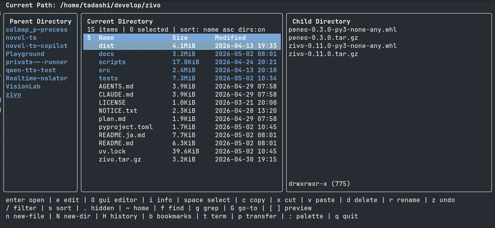

# zivo


---
[English](README.md) | [日本語](README.ja.md)
---

zivo は、**「発見可能性 > 暗記」**を設計原則とする TUI ファイルマネージャです。

よく使う操作はヘルプバーに常に表示し、その他は `:` のコマンドパレットからワンアクションで実行できます。**チートシートは不要です。**

ファイルの閲覧、プレビュー、検索、grep、置換、2 ディレクトリ間の転送をターミナル内で完結できます。

---

## zivo が向いている人

- 強力な TUI ファイルマネージャを**キーバインド暗記なしで**使いたい人
- **見つけやすさ**を重視し、ドキュメントを先に読むのは避けたい人
- 既存の TUI ファイルマネージャは便利だが**初期学習コストが高い**と感じる人
- WSL やターミナル中心の環境で、GUI ファイラーに切り替えず作業したい人

---

## zivo の違い

- **暗記ではなく「見つけやすさ」**: ヘルプバーに常用操作 + コマンドパレット（`:`）ですべての操作にアクセス
- **統合された検索・置換**: ファイル検索、grep、diff プレビュー付き置換 — すべて統合 UI で、ターミナルでコマンドを実行する必要はありません
- **アプリ内で設定**: UI でインタラクティブに設定を編集 — 設定ファイルを手動で編集する必要はありません
- **Transfer モード**: 2 ペイン並列表示でファイル操作を直感的に

**その他の基本機能**: プレビュー（テキスト/画像/PDF/Office）、タブ、Undo、ブックマーク、履歴ナビゲーション

---

## なぜ zivo なのか？

多くの TUI ファイルマネージャが存在します。zivo が異なる点は 4 つあります。

1. **見つけやすさ第一**: ヘルプバーにモード別操作を表示。コマンドパレット（`:`）ですべてを検索。マニュアル読み不要。
2. **統合された検索・置換**: すべて統合 UI で — ターミナルでコマンドを実行する必要はありません。
3. **アプリ内で設定**: zivo 内で設定を編集 — 設定ファイルを手動で編集する必要はありません。
4. **低い学習コスト**: ショートカットの力よりも視覚的な見つけやすさを重視。

ミニマリズムと速度より使いやすさを重視するなら、他のツールの方が良いかもしれません。**パワーと見つけやすさの両方**を求めるなら、zivo を試してみてください。

---

3 ペインでディレクトリを移動しながら右ペインでファイルをプレビューできます。**ヘルプバーにより、キーバインドを暗記したり迷ったりすることはありません。**


`:` のコマンドパレットから操作を検索・実行できます。コマンドはインクリメンタルサーチに対応しています。



Transfer モードでは、2つのディレクトリを左右に並べて、選択したファイルを反対側のペインへコピーまたは移動できます。`y` でコピー、`m` で移動できます。


---

## インストール

### 最小構成

```bash
uv tool install zivo
```

### 推奨ツール

一部の機能は外部コマンドを利用します。

| 機能 | 使用するツール |
| --- | --- |
| 画像プレビュー | `chafa` |
| PDF プレビュー | `pdftotext` / `poppler` |
| Office プレビュー | `pandoc` |
| grep 検索 | `ripgrep` |

OS 別の詳しいセットアップは [Platforms](docs/platforms.ja.md) を参照してください。

---

## 起動

```bash
zivo
```

`zivo` 単体では親シェルのカレントディレクトリを変更できません。終了時に最後に見ていたディレクトリへ親シェルも追従させたい場合は、先に shell integration を読み込みます。

```bash
eval "$(zivo init bash)"  # bash 用
eval "$(zivo init zsh)"   # zsh 用
```

これにより `zivo-cd` というシェル関数が定義されます。終了後に親シェルを最後のディレクトリへ `cd` させたいときは、`zivo` ではなく `zivo-cd` で起動します。

```bash
zivo-cd
```

**注**: シェル統合 (`zivo-cd`) は現在 Windows ではサポートされていません。Windows では通常の `zivo` を使用してください。

---

## 基本操作

| キー | 操作 |
|---|---|
| `↑` / `↓` or `j` / `k` | 移動 |
| `Enter` | 開く / ディレクトリに入る |
| `Backspace` / `←` | 親ディレクトリへ戻る |
| `Space` | 選択 |
| `:` | コマンドパレット |
| `/` | フィルタ |
| `f` | ファイル検索 |
| `g` | grep 検索 |
| `p` | Transfer モード切替 |
| `q` | 終了 |

詳しいキーバインドは [Keybindings](docs/keybindings.ja.md) を参照してください。

詳しいコマンド一覧は [Commands](docs/commands.ja.md) を参照してください。

---

## サポート機能一覧

### ファイル操作
- **コピー / カット / ペースト**: 同一ペイン内または Transfer モードで実行
- **Undo**: リネーム / ペースト / ゴミ箱移動を取り消し
- **リネーム**: インラインリネーム
- **削除**: ゴミ箱移動（`d`）または完全削除（`D`）、確認ダイアログ設定可能
- **複数選択**: Space で選択、Select all で一括選択
- **アーカイブ**: zip 圧縮、zip / tar / tar.gz / tar.bz2 展開

### ブラウズ
- **3 ペインブラウズ**: 左ペインでツリー、中央ペインでファイル一覧、右ペインでプレビュー
- **レスポンシブペイン**: ターミナル幅に応じてサイドペインを自動調整
- **タブ**: 複数ディレクトリをタブで切り替え
- **履歴ナビゲーション**: 戻る / 進むで履歴移動、履歴検索機能
- **ブックマーク**: ディレクトリを保存して即時ジャンプ
- **パス直接入力**: Tab 補完付きで任意のパスに移動

### 検索・置換
- **ファイル検索**: 再帰的にファイル名を検索
- **grep 検索**: ripgrep による再帰検索（ファイル名 / 拡張子フィルタ対応）
- **置換**: 選択ファイル、ファイル検索結果、grep 結果を対象に **diff プレビュー付き**で一括置換

### プレビュー
- テキスト / 画像（chafa）/ PDF（pdftotext）/ Office（pandoc）

### Transfer モード
- 2 ペインを左右に並べ、選択ファイルを反対側のペインへコピーまたは移動

### コマンドパレット
- `:` で全操作をインクリメンタルサーチから実行。**キーバインドを覚える必要なし**

### カスタマイズ
- **設定オーバーレイ**: 起動時設定を**対話的に編集・保存** — 手動で設定ファイルを編集する必要はありません
- **カスタムアクション**: 外部ツールをコマンドパレットに追加
- **config.toml**: テーマ、ソート、プレビュー表示、削除確認などを設定

### 外部連携
- **エディタ起動**: ターミナルエディタ / GUI エディタでファイルを開く
- **ターミナル起動**: 現在ディレクトリで外部ターミナルを開く
- **シェルコマンド**: 現在ディレクトリでコマンドを実行
- **ファイルマネージャ**: OS のファイルマネージャで開く
- **クリップボード**: パスをシステムクリップボードにコピー

---

## 設定

zivo は初回起動時に `config.toml` を自動生成します。
テーマ、プレビュー、ソート、エディタ連携、削除確認などを設定できます。
また、外部ツールを起動するカスタムアクションをコマンドパレットに追加できます。

詳しくは [Configuration](docs/configuration.ja.md) を参照してください。
カスタムアクションの設定例と安全上の注意は [Custom Actions](docs/custom-actions.ja.md) を参照してください。

---

## 安全性について

zivo はファイル操作の事故を防ぐための安全機構を備えています。

- **ゴミ箱移動**: `d` / `Delete` で OS 標準のゴミ箱へ移動（確認ダイアログ表示可能）
- **完全削除**: `D` / `Shift+Delete` は常に確認後に実行
- **Undo**: `z` で直前のリネーム・貼り付け・ゴミ箱移動を取り消し
- **貼り付け競合解決**: 上書き / スキップ / リネームを選択可能
- **置換プレビュー**: diff preview で確認してから一括置換を実行
- **その他の詳細**: [Safety](docs/safety.ja.md) を参照

---

## 関連ドキュメント

- [Keybindings](docs/keybindings.ja.md) — 全キーバインド一覧
- [Commands](docs/commands.ja.md) — コマンドパレット全コマンド一覧
- [Custom Actions](docs/custom-actions.ja.md) — カスタムアクション設定ガイド
- [Configuration](docs/configuration.ja.md) — 設定ファイルの詳細
- [Platforms](docs/platforms.ja.md) — OS 別セットアップ
- [Safety](docs/safety.ja.md) — 安全仕様
- [Architecture](docs/architecture.md) — 実装構造
- [Performance](docs/performance.md) — 性能確認メモ
- [Release Checklist](docs/release-checklist.md) — リリースチェックリスト

---

## ライセンス

zivo は MIT ライセンスで提供されています。詳細は [LICENSE](LICENSE) を確認してください。

### サードパーティーライセンス

zivo はサードパーティーパッケージに依存しています。依存パッケージとそのライセンスの一覧は [NOTICE.txt](NOTICE.txt) を確認してください。

依存関係を更新した後に NOTICE.txt を更新するには:

```bash
uv run pip-licenses --format=plain --from=mixed --with-urls --output-file NOTICE.txt
```

---

## その他

### ベータ版について

zivo は現在ベータ版です。機能追加、キーバインド見直しにより、キーバインドは変更の可能性があります。

---

## 開発者向け

開発環境を作る場合は次を実行します。

```bash
uv sync --python 3.12 --dev
```

ローカル checkout から直接アプリを起動する場合は、リポジトリ直下で次を使えます。

```bash
uv run zivo
```

テストと静的検査:

```bash
uv run ruff check .
uv run pytest
```

### TestPyPI からインストール

リリース前のバージョンをテストする場合は、TestPyPI からインストールできます:

```bash
uv tool install \
  --index-url https://test.pypi.org/simple/ \
  --extra-index-url https://pypi.org/simple/ \
  --index-strategy unsafe-best-match \
  zivo
```
